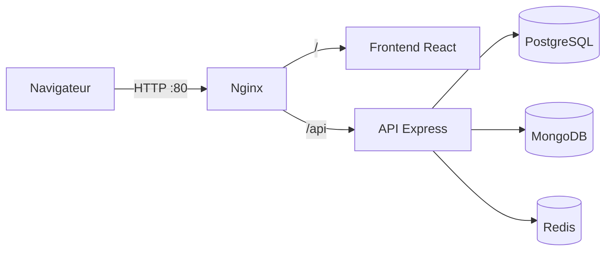

# EventHub

Plateforme de gestion d'événements et de billetterie en ligne : les **organisateurs** créent, promeuvent et pilotent leurs événements, les **participants** les découvrent et réservent leurs places, les **administrateurs** supervisent la plateforme.

Projet fil rouge — Concepteur Développeur d'Applications (CDA), 3WA.

## Sommaire

- [Stack technique](#stack-technique)
- [Architecture](#architecture)
- [Structure du dépôt](#structure-du-dépôt)
- [Démarrage](#démarrage)
- [Qualité du code](#qualité-du-code)
- [Organisation du travail](#organisation-du-travail)
- [Documentation](#documentation)

## Stack technique

| Couche             | Technologie                                      |
| ------------------ | ------------------------------------------------ |
| Frontend           | React, TypeScript, Vite                          |
| Backend            | Node.js, Express, TypeScript                     |
| Base relationnelle | PostgreSQL                                       |
| Base NoSQL         | MongoDB                                          |
| Cache              | Redis                                            |
| Serveur web        | Nginx                                            |
| Authentification   | JWT                                              |
| Conteneurisation   | Docker, docker-compose                           |
| Qualité            | ESLint, Prettier, Husky, lint-staged, commitlint |

## Architecture



Chaque service tourne dans son propre conteneur. Nginx est le seul point d'entrée exposé ; les bases ne sont accessibles que depuis le réseau Docker interne.

Le détail des choix (rôle de chaque base, sécurité, enjeux DevOps) est dans l'[analyse du projet](docs/analyse-projet.md).

## Structure du dépôt

```
eventhub/
├── .github/
│   ├── ISSUE_TEMPLATE/        # Modèles d'issues (fonctionnalité, bug)
│   └── pull_request_template.md
├── .husky/                    # Hooks Git (pre-commit, commit-msg)
├── docs/                      # Documentation du projet
├── .editorconfig              # Règles d'édition communes (indentation, fins de ligne)
├── .gitattributes             # Fins de ligne LF forcées dans le dépôt
├── commitlint.config.mjs      # Règles des messages de commit
├── eslint.config.mjs          # Règles de lint
└── package.json               # Outils de qualité partagés
```

`apps/api` : API Express · `apps/web` : front React · `docker-compose.yml` : environnement de dev.

## Démarrage

### Prérequis

- Node.js 20 ou supérieur
- npm
- Git
- Docker et Docker Compose

### Installation

```bash
git clone https://github.com/BRCorg/eventhub.git
cd eventhub
git switch dev
npm install
```

`npm install` installe aussi les hooks Git (script `prepare`) : aucune configuration manuelle n'est nécessaire.

### Lancer l'environnement de développement (Docker)

```bash
cp .env.example .env        # puis changer les mots de passe
docker compose up --build
```

| Service    | URL / port                        | Rôle                                    |
| ---------- | --------------------------------- | --------------------------------------- |
| `web`      | http://localhost:5173             | Front React (Vite, hot-reload)          |
| `api`      | http://localhost:3000/api/healthz | API Express (nodemon + tsx, hot-reload) |
| `postgres` | `localhost:5432`                  | Base relationnelle                      |
| `mongo`    | `localhost:27017`                 | Base NoSQL                              |
| `redis`    | `localhost:6379`                  | Cache                                   |

- **Hot-reload** : le code de `apps/api` et `apps/web` est monté en **bind mount** ; toute modification redémarre l'API ou recharge la page.
- **Volumes nommés** `pgdata` et `mongodata` : les données survivent à `docker compose down` (`docker compose down -v` pour tout effacer).
- **Réseaux** : `backend` (API + bases) et `frontend` (web + API) ; le front n'a pas accès aux bases.
- **Dockerfiles multi-stage** : `dev` (hot-reload), `build` (compilation), `prod` (image finale légère, utilisateur non-root pour l'API, Nginx pour le front).

Construire les images de production :

```bash
docker build --target prod -t eventhub-api ./apps/api
docker build --target prod -t eventhub-web ./apps/web
```

### Scripts

| Commande               | Rôle                                            |
| ---------------------- | ----------------------------------------------- |
| `npm run lint`         | Analyse le code avec ESLint                     |
| `npm run lint:fix`     | Corrige automatiquement ce qui peut l'être      |
| `npm run format`       | Formate tout le projet avec Prettier            |
| `npm run format:check` | Vérifie le formatage sans modifier (pour la CI) |

## Qualité du code

Chaque commit passe automatiquement par deux hooks Git :

| Hook         | Vérification                                                              |
| ------------ | ------------------------------------------------------------------------- |
| `pre-commit` | ESLint et Prettier sur les fichiers indexés (`*.{ts,tsx,js,json,md,yml}`) |
| `commit-msg` | Message conforme à [Conventional Commits](docs/conventions-commit.md)     |

Un commit qui ne respecte pas ces règles est refusé.

## Organisation du travail

- **Branches** : `main` (production) et `dev` (intégration) sont protégées ; tout passe par des branches éphémères et des Pull Requests — voir le [workflow Git](docs/workflow-git.md).
- **Tâches** : chaque tâche est une issue GitHub, suivie sur le tableau Kanban du projet (Backlog → Ready → In progress → Review → Done).
- **Pull Requests** : une PR référence son issue (`Closes #n`) pour la fermer automatiquement au merge.

## Documentation

| Document                                            | Contenu                                                              |
| --------------------------------------------------- | -------------------------------------------------------------------- |
| [Analyse du projet](docs/analyse-projet.md)         | Analyse du cahier des charges, architecture, sécurité, enjeux DevOps |
| [Conventions de commit](docs/conventions-commit.md) | Format des messages, types, exemples, vérification automatique       |
| [Workflow Git](docs/workflow-git.md)                | Branches, cycle de travail, hotfix, règles de protection             |
