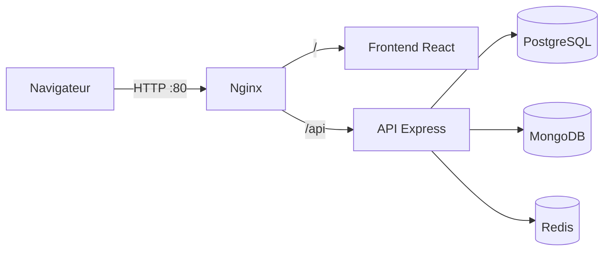
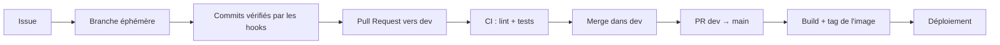

# Analyse du projet EventHub

Analyse du cahier des charges (CDCF) du projet fil rouge CDA : ce que la plateforme doit faire, pour qui, avec quelles contraintes, et ce que cela implique pour l'architecture et la démarche DevOps.

## 1. Contexte et problème

Les événements physiques et virtuels (conférences, ateliers, concerts, expositions) se multiplient. Deux besoins en découlent :

- **les organisateurs** ont besoin d'un outil unique pour créer, promouvoir et piloter leurs événements, sans jongler entre billetterie, tableur et emails ;
- **les participants** veulent trouver un événement qui les intéresse et réserver sans friction.

EventHub répond aux deux avec une plateforme unique de gestion d'événements et de billetterie en ligne.

## 2. Acteurs et besoins

| Acteur             | Besoins principaux                                                                                        |
| ------------------ | --------------------------------------------------------------------------------------------------------- |
| **Participant**    | Rechercher et filtrer des événements, réserver et payer, retrouver ses billets, annuler une réservation   |
| **Organisateur**   | Créer et publier des événements, gérer les places et les tarifs, suivre les inscrits, analyser les ventes |
| **Administrateur** | Modérer les événements et les comptes, superviser la plateforme                                           |

Ces trois rôles impliquent un **contrôle d'accès par rôle** côté API : chaque route vérifie le JWT **et** le rôle de l'utilisateur.

## 3. Périmètre fonctionnel

| Domaine                | Fonctionnalités                                         | Stockage pressenti                      |
| ---------------------- | ------------------------------------------------------- | --------------------------------------- |
| Comptes                | Inscription, connexion, rôles, profil                   | PostgreSQL                              |
| Événements             | CRUD, catégories, lieu ou lien en ligne, date, capacité | PostgreSQL                              |
| Réservations / billets | Réservation, contrôle des places restantes, annulation  | PostgreSQL (transactions)               |
| Paiements              | Paiement en ligne, statut du paiement                   | PostgreSQL + prestataire externe        |
| Recherche              | Liste filtrée et paginée des événements                 | PostgreSQL, résultats cachés dans Redis |
| Analyse organisateur   | Ventes, taux de remplissage, consultations              | MongoDB (événements de suivi)           |

**Pourquoi deux bases de données ?**

- **PostgreSQL** pour le cœur métier : les réservations et les paiements exigent des **transactions** et de l'**intégrité référentielle**. Deux personnes ne doivent jamais pouvoir réserver la dernière place en même temps.
- **MongoDB** pour les données volumineuses et peu structurées : journaux d'activité, statistiques de consultation, alimentées en continu et lues de façon agrégée.
- **Redis** comme cache : la liste des événements est très lue et peu modifiée. La servir depuis la mémoire soulage PostgreSQL.

## 4. Contraintes techniques

| Contrainte du CDCF                        | Choix retenu                                                    |
| ----------------------------------------- | --------------------------------------------------------------- |
| Architecture en couches                   | API organisée en routes → contrôleurs → services → repositories |
| Frontend responsive en TypeScript + React | React + Vite + TypeScript                                       |
| Backend Node.js + Express + TypeScript    | Express + TypeScript, compilé avec `tsc`                        |
| Base relationnelle                        | PostgreSQL                                                      |
| API REST sécurisée                        | Routes préfixées `/api`, JWT, validation des entrées            |
| Authentification JWT                      | Token signé, vérifié par un middleware                          |
| Conteneurisation                          | Docker, un conteneur par service, docker-compose                |

### Architecture cible

Six conteneurs, conformément au CDCF : **frontend**, **API**, **PostgreSQL**, **MongoDB**, **Redis** et **Nginx**. Nginx est le seul point d'entrée exposé : il sert le frontend et relaie `/api` vers l'API. Les bases ne sont joignables que depuis le réseau Docker interne.

## 5. Sécurité

Le CDCF fait de la sécurité des données personnelles et des transactions un objectif à part entière (objectif 4).

| Risque                      | Mesure                                                         |
| --------------------------- | -------------------------------------------------------------- |
| Vol de mots de passe        | Hachage (bcrypt / argon2), jamais de mot de passe en clair     |
| Accès non autorisé          | JWT à durée de vie courte + contrôle du rôle sur chaque route  |
| Fuite de secrets            | Secrets dans `.env` non versionné, `.env.example` comme modèle |
| Injection SQL               | Requêtes paramétrées / ORM                                     |
| Bases exposées              | Bases accessibles uniquement par le réseau Docker interne      |
| Conteneur compromis         | Images exécutées avec un utilisateur non-root                  |
| Données personnelles (RGPD) | Collecte minimale, suppression de compte possible              |

## 6. Enjeux DevOps

Le CDCF demande une démarche DevOps complète (objectif 6). L'enjeu est que **chaque modification soit vérifiée, construite et déployée de la même façon, automatiquement**, pour livrer souvent sans casser la production.

| Étape                    | Ce qu'elle garantit                                 | Mise en œuvre                                                                                  | État    |
| ------------------------ | --------------------------------------------------- | ---------------------------------------------------------------------------------------------- | ------- |
| **Qualité locale**       | Aucun commit mal formaté ou mal nommé               | Husky + lint-staged (ESLint, Prettier) + commitlint                                            | ✅ Fait |
| **Gestion de versions**  | Historique lisible, production protégée             | Workflow `main` / `dev` / branches éphémères, PR obligatoires                                  | ✅ Fait |
| **Organisation**         | Travail planifié et traçable                        | Issues + tableau Kanban GitHub Projects                                                        | ✅ Fait |
| **Conteneurisation**     | Même environnement en dev, en test et en production | Dockerfiles multi-stage, docker-compose                                                        | À venir |
| **Intégration continue** | Chaque PR est lintée et testée avant merge          | GitHub Actions : lint, tests unitaires et d'intégration                                        | À venir |
| **Livraison continue**   | Une image prête à déployer pour chaque version      | Build et push automatiques des images (Docker Hub)                                             | À venir |
| **Déploiement continu**  | Mise en production reproductible et réversible      | Script de déploiement, configuration par environnement, rollback vers le tag d'image précédent | À venir |

### Lien entre les outils

Une tâche part d'une **issue** du tableau Kanban, est développée sur une **branche éphémère**, et n'atteint `main` qu'après être passée par les **hooks**, la **Pull Request** et la **CI**. Le numéro de version suit Conventional Commits (`fix` → PATCH, `feat` → MINOR, breaking change → MAJOR) et sert à **taguer les images Docker**, ce qui rend le rollback possible : redéployer le tag précédent.

## 7. Risques du projet

| Risque                                         | Parade                                                                                       |
| ---------------------------------------------- | -------------------------------------------------------------------------------------------- |
| Surréservation (deux réservations simultanées) | Transaction et verrou sur le nombre de places                                                |
| Échec du paiement après réservation            | Statut « en attente » et expiration de la réservation                                        |
| Environnements différents entre développeurs   | Tout conteneurisé, configuration dans `.env`                                                 |
| Régression en production                       | CI obligatoire avant merge, rollback par tag d'image                                         |
| Périmètre trop large                           | Priorisation dans le Kanban : comptes → événements → réservations → paiements → statistiques |
