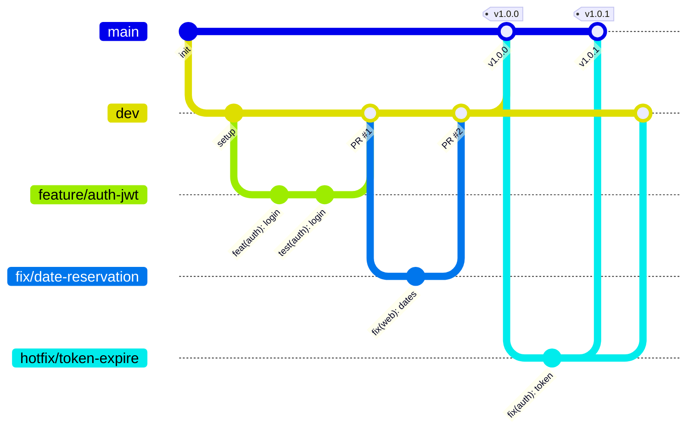

# Workflow Git

## Objectif

Définir un flux de travail simple et reproductible : chaque modification suit le même chemin, passe par une Pull Request et n'atteint la production qu'après avoir été intégrée et vérifiée sur `dev`.

## Branches

| Branche     | Rôle                                                 | Durée de vie                     | Alimentée par                                    |
| ----------- | ---------------------------------------------------- | -------------------------------- | ------------------------------------------------ |
| `main`      | Production : code stable et livrable                 | Permanente, **protégée**         | PR depuis `dev` ou `hotfix/*`                    |
| `dev`       | Intégration : regroupe les fonctionnalités terminées | Permanente, **protégée**         | PR depuis les branches éphémères                 |
| `feature/*` | Nouvelle fonctionnalité                              | Éphémère (supprimée après merge) | Commits directs                                  |
| `fix/*`     | Correction de bug                                    | Éphémère                         | Commits directs                                  |
| `docs/*`    | Documentation                                        | Éphémère                         | Commits directs                                  |
| `chore/*`   | Maintenance, configuration                           | Éphémère                         | Commits directs                                  |
| `hotfix/*`  | Correction urgente en production                     | Éphémère                         | Part de `main`, revient dans `main` **et** `dev` |

### Nommage des branches éphémères

```
<type>/<description-courte-en-kebab-case>
```

Les types reprennent ceux des [conventions de commit](conventions-commit.md).

```
feature/auth-jwt
fix/date-reservation
docs/workflow-git
chore/config-eslint
hotfix/token-expire
```

## Cycle de travail

1. **Partir de `dev` à jour**

   ```bash
   git switch dev
   git pull
   ```

2. **Créer une branche éphémère**

   ```bash
   git switch -c feature/auth-jwt
   ```

3. **Commiter** en respectant Conventional Commits (vérifié par le hook `commit-msg`)

   ```bash
   git add .
   git commit -m "feat(auth): ajouter la connexion par JWT"
   ```

4. **Pousser la branche**

   ```bash
   git push -u origin feature/auth-jwt
   ```

5. **Ouvrir une Pull Request** vers `dev` sur GitHub

6. **Merger** une fois les vérifications passées, puis **supprimer la branche**

   ```bash
   git switch dev
   git pull
   git branch -d feature/auth-jwt
   git push origin --delete feature/auth-jwt
   ```

   La suppression distante est automatique si l'option **Settings → General → Automatically delete head branches** est activée.

7. **Livrer** : ouvrir une Pull Request de `dev` vers `main` (stratégie **Create a merge commit**), puis poser un tag annoté et publier une release GitHub

   ```bash
   git switch main
   git pull
   git tag -a v1.0.0 -m "v1.0.0 : description de la version"
   git push origin v1.0.0
   ```

### Cas du hotfix

Un bug bloquant en production se corrige depuis `main`, sans attendre le contenu de `dev` :

1. `git switch main && git pull`
2. `git switch -c hotfix/token-expire`
3. Corriger, commiter, pousser
4. PR vers `main` → merge → tag de version PATCH (`v1.0.1`)
5. PR (ou merge) de `main` vers `dev` pour que la correction ne soit pas perdue

## Schéma



## Règles de protection

Configurées sur GitHub dans **Settings → Branches → Branch protection rules**.

| Règle                                                | `main` | `dev` |
| ---------------------------------------------------- | :----: | :---: |
| Pull Request obligatoire avant merge                 |   ✅   |  ✅   |
| Approbations requises                                |   0    |   0   |
| Résolution des conversations obligatoire             |   ✅   |  ✅   |
| Vérifications CI obligatoires (dès que la CI existe) |   ✅   |  ✅   |
| Règles appliquées aussi aux administrateurs          |   ✅   |   —   |
| Force push autorisé                                  |   ❌   |  ❌   |
| Suppression de la branche autorisée                  |   ❌   |  ❌   |

> **Approbations à 0** : le projet est réalisé seul et GitHub interdit d'approuver sa propre Pull Request. La PR reste obligatoire ; seule la relecture par un tiers est désactivée. À passer à 1 en équipe.

Conséquence : aucun `git push` direct n'est possible sur `main` ou `dev`, toute modification passe par une Pull Request.


## En résumé

- On ne commite **jamais** directement sur `main` ou `dev`
- Une tâche = une branche éphémère = une Pull Request
- `dev` → `main` uniquement pour livrer une version
- Les branches éphémères sont supprimées après merge
